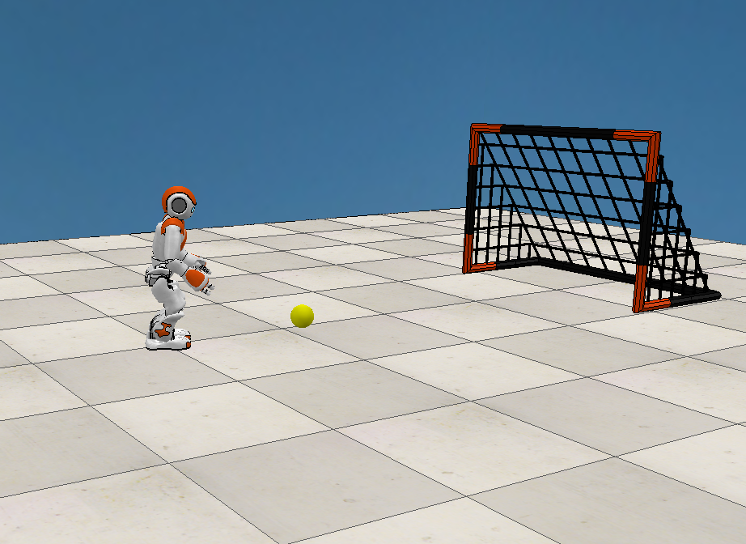
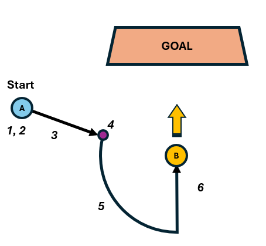
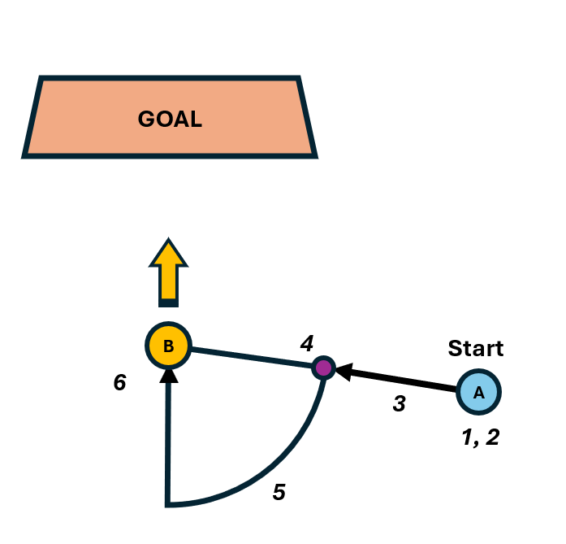

# Visual Servoing with Nao Robot


## Project Overview
This project leverages visual servoing to enable a Nao robot to autonomously score a goal in a virtual environment using V-Rep (CoppeliaSim).

The code is structured around a **finite state machine (FSM)**, ensuring modular and reactive behavior. The robot transitions between predefined states based on sensory feedback and task completion. 

A **custom Vision Task Manager** enables efficient multi-threaded detection of key elements (ball and goal), ensuring real-time responsiveness.  

Additionally, a **custom modular PID Controller** is used to regulate movements. This controller allows:  
- **Dynamic frequency adjustments** to balance reactivity and stability.  
- **Compatibility with different actuators**, making it adaptable for various tasks beyond head movement.  
- **Real-time tuning of PID parameters** via an OpenCV trackbar window, enabling fine control over head movement.  


⚠️ **Warning:** Due to the inherent instability of the physics engine, extensive fine-tuning of the robot's movement parameters was necessary to prevent frequent slipping and falling. This project was tested in **V-Rep** using the following settings: **ODE engine, Very Accurate mode, 50ms simulation step**.  

---
## Installation

Run the following Docker command to set up the environment (replace [user_dir] with the appropriate folder name):

```sh
docker run -it --rm --name ue52vs \
    -v /home/[user_dir]/VisualServoing:/home/ue52vs/vs \
    -v /tmp/.X11-unix:/tmp/.X11-unix \
    -e DISPLAY=$DISPLAY \
    ${docker_image} ${cmd}
```

---
## Running V-Rep (Docker Image)

To launch V-Rep (CoppeliaSim) from the Docker image:

```sh
docker stop ue52vs
```

Then run:

```sh
cd VisualServoing && ./run.bash
```

---
## Running the Project Script

### In a second terminal:

Start an interactive Bash session inside the container:

```sh
docker exec -it ue52vs /bin/bash
```

Then, execute the script with:

```sh
cd vs/py/project && python main.py 60 1 localhost 11212 0.2 0.0 0.0
```

or:

```sh
cd vs/py/project && python main.py 600 1
```

For subsequent executions:

```sh
python main.py 600 1 localhost 11212 0.2 0.0 0.0
```

or simply:

```sh
python main.py 600
```

### Command Line Arguments:
- `duration`: Duration of the main loop (in seconds).
- `mode`: Execution mode (e.g., `normal`(0) or `debug`(1)). Debug mode enable camera view and trackbars windows.
- `robot_ip`: IP address of the robot.
- `robot_port`: Port for robot communication.

---
## Strategy
| Trajectory (Ex. 1) |  | Trajectory (Ex. 2) |
|--------------|--|--------------|
|  | |  |


### 1. Ball Search
The robot searches for the ball by scanning with its head:
- First, a circular sweeping motion (left, up, right, down).
- If the ball is not found, it turns its body to continue the search.

### 2. Alignment with the Ball
Once the ball is found:
- The head visually tracks the ball (fast servoing).
- Simultaneously, the body aligns with the ball to ensure the head, body, and feet are properly oriented (slow servoing).

### 3. Approaching the Ball
After alignment:
- The robot walks straight towards the ball, minimizing the distance to optimize time for the next steps.

### 4. Goal Search
Using only its head, the robot scans the scene similarly to Step 1 to identify the relative position of the goal (left or right).

### 5. Circular Movement for Goal Alignment
Depending on the goal’s position:
- The robot moves laterally in the opposite direction while keeping the head centered on the ball.
- When the angle between the head and body becomes too large, the robot rotates to realign its body, head, and feet.
- This process continues until the robot is aligned with both the ball and the goal.

### 6. Shooting
Once properly aligned:
- The robot attempts to score by walking as straight as possible toward the ball.
- The lower camera helps track the ball at close range, ensuring lateral corrections for better accuracy.

### 7. Celebration (Not yet implemented)
If the robot scores a goal, it could eventually celebrate its victory.

---
## Useful Informations

### API Documentation
[NAO Robot API Documentation](http://doc.aldebaran.com/2-1/dev/python/index.html)
